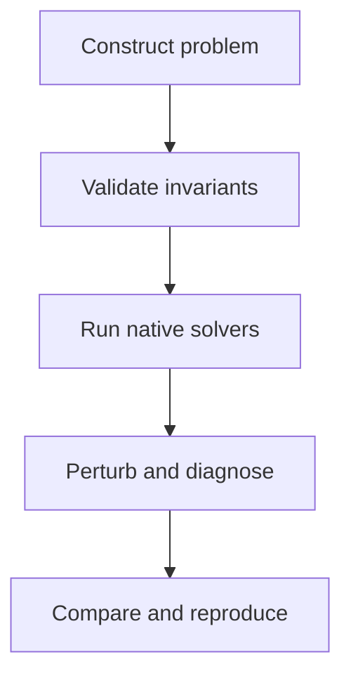

# TAPLab

## An Open Laboratory for Reproducible Traffic Assignment Experiments

TAPLab is a software-neutral environment for constructing, validating,
solving, perturbing, and comparing traffic assignment problems.

Unlike a conventional benchmark collection, TAPLab supports the complete
experimental lifecycle: from network and demand preparation to solver
execution, convergence diagnosis, sensitivity analysis, and independent
reproduction.

TAPLab does not require participating algorithms to use the same internal
network representation or software architecture. It defines portable
problem inputs, mathematical invariants, standardized outputs, and common
evaluation protocols while allowing each solver to retain its native
implementation.

> Here, **TAP** means the Traffic Assignment Problem. This project is
> unrelated to Cornell's Transportation Access and Policy Lab; always use
> the full subtitle when citing.

## The laboratory hierarchy

| Module | Role |
|---|---|
| **TAPLab** | the overall open laboratory (this repository) |
| **TAPBench** | the standardized benchmark module: instances + protocols (`instances/`, `taplab.bench`) |
| **TAPAdapters** | thin interfaces to AequilibraE, DTALite/TAPLite, tap-b, and other solvers (`taplab/adapters/`) |
| **TAPReports** | validation, convergence, and reproducibility reports (`taplab/reports.py`, `reports/`) |

## The experimental workflow



Five experimentation functions:

1. **Build** — construct assignment-ready instances from open or agency models.
2. **Validate** — check topology, zones, demand, connectors, costs, and units.
3. **Solve** — run different native algorithms through thin adapters.
4. **Experiment** — perturb demand, capacity, costs, zones, connectors, and convergence settings.
5. **Reproduce** — compare normalized outputs and independently verify published results.

## Quick start

```bash
pip install -e .

# Validate the complete problem
taplab validate instances/sioux_falls

# Run a benchmark (built-in pure-Python reference solver, no dependencies)
taplab run sioux_falls --solver reference_fw --gap 1e-6

# Compare algorithms
taplab compare sioux_falls --solvers reference_fw,taplite

# Test demand and capacity perturbations
taplab experiment sioux_falls --demand-scale 0.8,1.0,1.2 --capacity-scale 0.8,1.0

# Generate a reproducibility report
taplab reproduce results/sioux_falls/experiment.yml
```

## Exchange representation

TAPLab uses compact, GMNS-compatible node and link tables as its default
exchange representation. Solver adapters translate these portable inputs
into each modeling system's native structures.

The basic traffic-assignment zone is a **centroid row in `node.csv`**
(`node_type=centroid`); a separate zone file is not required. Centroid
connectors are ordinary links with `link_type=centroid_connector`.
Operational rules (enforced by `taplab validate`):

* Every demand zone corresponds to one centroid in `node.csv`.
* The centroid is identified by `node_type=centroid`; prefer `node_id = zone_id`.
* Every centroid has at least one valid connector (or, as in classic
  academic instances, coincides with a physical node).
* Connectors cannot be used as shortcuts between physical roadway nodes.
* A polygon file is optional (`optional/zone.geojson`) and used only for
  zone geometry, socioeconomic attributes, or spatial analysis.

## Instance structure

```text
instances/
└── sioux_falls/
    ├── manifest.yml
    ├── node.csv
    ├── link.csv
    ├── demand.csv
    ├── settings.yml
    ├── README.md
    ├── optional/
    └── reference/
        ├── summary.json
        ├── link_performance.csv
        └── convergence.csv
```

## Adapters

| Adapter | Backend | Notes |
|---|---|---|
| `reference_fw` | built-in pure-Python Frank–Wolfe | zero dependencies; the reproducibility anchor |
| `taplite` | TAPLite / DTALite kernel (GMNS-native) | set `TAPLAB_TAPLITE_EXE` |
| `tapb` | tap-b (Dial's Algorithm B, SPARTA) | set `TAPLAB_TAPB_EXE`; TNTP conversion built in |
| `aequilibrae` | AequilibraE (bfw, cfw, fw, msa) | `pip install aequilibrae` |

Adding a solver = one file implementing `Adapter.solve()` returning
normalized link flows. See `taplab/adapters/base.py`.

## License

MIT. Benchmark instances retain their original data licenses
(Sioux Falls: the classic academic instance via the TNTP repository).
